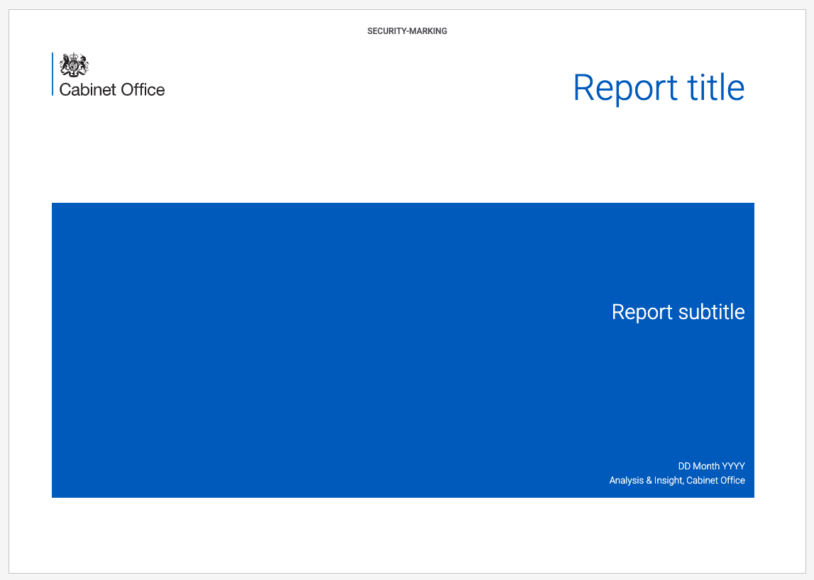
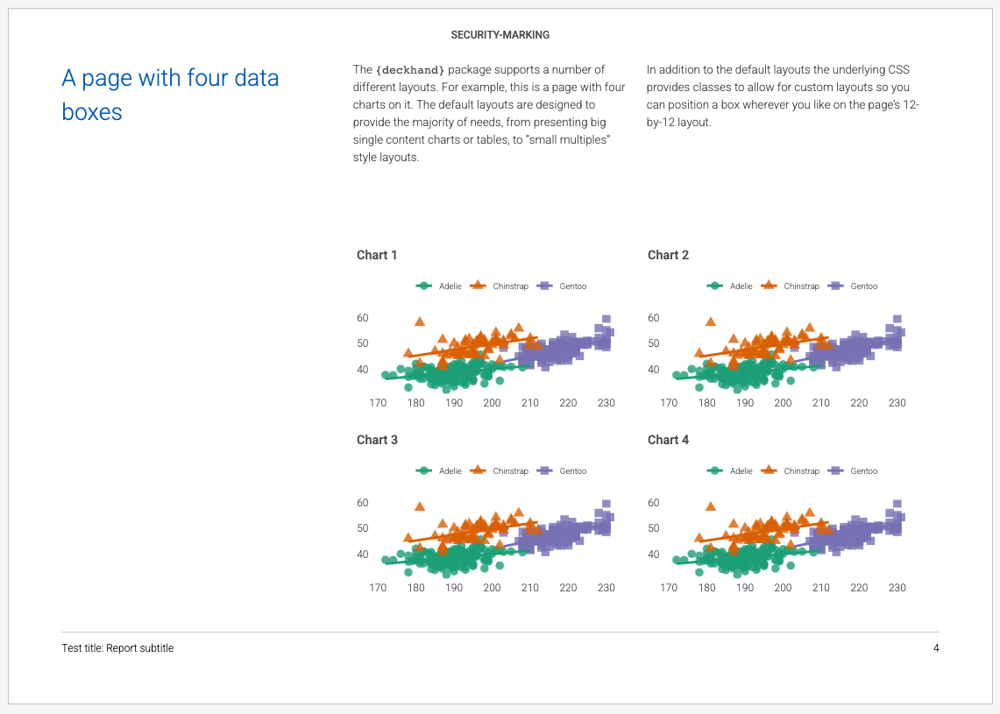

# deckhand
The `{deckhand}` package is a wrapper around the [{pagedown}](https://pagedown.rbind.io/) package to enable you to make reports in Rmarkdown that align (broadly) with the Cabinet Office’s corporate identity guidelines[^1].

Often data heavy reports have been laid out using presentation software and therefore called "slide decks" even though they aren't presented but usually turned into PDFs and printed. A deckhand is an experienced seaman in the merchant navy who helps with the general running of a ship, the `{deckhand}` package helps you produce your report.

## Installation
The package is not on CRAN, you can install it using the [{remotes}](https://remotes.r-lib.org/) package:

```r
remotes::install_github("co-analysis/deckhand")
```

## Getting started
To enable {deckhand} to work with your R Markdown file you should set the output format in the YAML header to `deckhand::co_deck`.

A template Rmarkdown file is included in the package. You can access this from RStudio by selecting: `File > New File > New R Markdown...` in the pop-up dialog window select `From Template` and then select `CO deck`.

{deckhand} makes use of Rmarkdown's native support for HTML class attributes which are then used by the {deckhand} CSS and the {pagedown} package to create paged HTML documents. The CSS includes a large number of built-in layout designs that mean you don't need to think about the specific positioning of elements, instead using the page type and default classes to rely on positioning. However, the CSS also supports custom layouts to work with the underlying grid system.

You create a page in your Rmarkdown document by using fenced DIV elements, which are created by three or more colons (e.g. `:::{.class}`), and setting the class to the relevant CSS classes.

A page is created in your Rmarkdown by creating a grid-page entity `::::{.grid-page .page-type}` where `.page-type` is the layout design you want to use (remember to close off with four colons `::::` before your next page).You can then include page elements such as `:::{.title}`, `:::{.maintext}` and `:::{.content1}`, closing each element with `:::`. To aid code scanning/navigation is recommended using the convention of four colons for the DIV relating to a page and three for elements inside the page. See below for an example.


````txt
::::{.grid-page .single-content}

:::{.title}
My page title
:::

:::{.maintext}
The narrative text for the page, goes here.
:::

:::{.content-1}
```{r}
my_awesome_chart_function()
```
:::

::::
````

There is also a layout for the report's front cover and for divider pages.




You can see a full example of all layouts by calling `deckhand::show_example_report()`, which will open an example in your default browser.

## Additional features

In addition to the Rmarkdown template and output format, {deckhand} also provides a number of useful functions to support the creation of reports:

* Functions to help with creating and inserting ggplot charts
* Functions to help create output tables using the {gt} package

The Cabinet Office corporate colour palette is also available via the vector `co_colours`


[^1]: The only major deviation from the Cabinet Office's corporate identity guidelines is the use of the [Heebo font](https://fonts.google.com/specimen/Heebo), served via Google Fonts (and embedded within the package). The Cabinet Office's corporate font is Helvetica Neue (replaced by Arial when not available), as a mixed IT environment with Mac devices (which have Helvetica Neue pre-installed) and Windows devices (which do not) Heebo has been selected to provide cross-platform compatability while retaining close similarity to Helvetica Neue.
